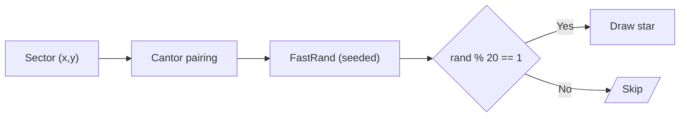

# Infinite Universe

A minimal C++/raylib/ImGui sandbox that renders an **infinite grid of sectors** and procedurally places deterministic "stars" inside them.  The camera can be panned with **W A S D** and every sector you visit is generated on-the-fly but always the same thanks to a fast hash-based PRNG.

<p align="center">
  
</p>

<p align="center">
  
</p>

---

## Quick start

```bash
# 1. Configure once (creates build/)
./setup.sh

# 2. Build + run
./make.sh
```

### Key controls

| Key | Action             |
|-----|--------------------|
| W/S | Pan camera up/down |
| A/D | Pan camera left/right |
| CAPS-LOCK | Quit demo |

---

## Building on different OSes

The project relies on **raylib** and ships with fall-back binaries for Linux.
CMake automatically picks the correct linkage:

```cmake
if(UNIX AND NOT APPLE)                 # Linux → use vendored static lib
  target_link_libraries(unigen_demo PUBLIC vendored/raylib/libraylib.a)
else()                                  # macOS / Windows → system package
  find_package(raylib REQUIRED)
  target_link_libraries(unigen_demo PRIVATE raylib)
endif()
```

• **macOS** – `brew install raylib`

• **Linux** – nothing extra, the static `libraylib.a` in *vendored/* is used (or
  replace it with a distro package & comment the CMake block).

• **Windows** – install via **vcpkg** (`vcpkg install raylib:x64-windows`) or
  MSYS2 (`pacman -S mingw-w64-x86_64-raylib`) and let `find_package` pick it up.

---

## Project layout

```
├── src/
│   ├── main.cpp          # main loop, ImGui init, camera
│   ├── color.hpp         # Catppuccin-like color palette
│   └── ui/
│       ├── jui.hpp/.cpp  # grid, star generation & rendering
├── vendored/             # imgui + (optionally) raylib static lib
└── CMakeLists.txt        # platform-aware build script
```

---

## Architecture at a glance

### Runtime flow

```mermaid
flowchart TD
    main["main()"] -->|InitWindow()| rl["raylib"]
    main -->|rlImGuiSetup()| imgui["ImGui"]
    main --> loop{{"Game loop"}}
    loop -->|update()/draw()| jui["Jui"]
    jui -->|"star PRNG"| stars["Star draw calls"]
    stars --> rl
    loop -->|rlImGuiBegin/End| imgui
    loop --> rl
    loop -->|EndDrawing()| rl
```

### Deterministic randomness



* **Cantor pairing function** `PerfectlyHasThem(x,y)` creates a unique 64-bit
  key from the integer sector coordinates.
* That key seeds `FastRand`, an ultra-small xorshift-style RNG (≈4 ns).
* If `randInteger(0,20)==1` we deem that sector to contain a star – on average
  **≈ 5 %** of sectors.
* The star is drawn in screen space, so it remains visible while scrolling; yet
  its existence remains deterministic.

---

## Extending

* Tweak `sec_size` in `Jui` to change grid density.
* Adjust the probability in `draw()` to spawn more/fewer stars.
* Replace the simple `DrawCircle` call with textured sprites or 3-D billboards.
* Use additional data from the hash/PRNG to give each star unique properties
  (color, size, spectral type – see `hoveredsc.png`).

---

## Credits

* **raylib** – cross-platform multimedia library ([wiki on CMake options](https://github.com/raysan5/raylib/wiki/CMake-Build-Options)).
* **Dear ImGui** – immediate-mode GUI.
* rlImGui – thin bridge between ImGui & raylib.

Released under the MIT/Zlib licenses of the respective components. 